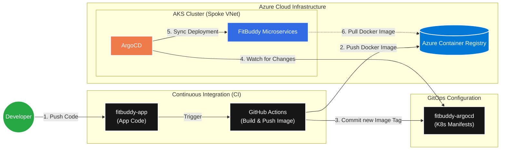

# FitBuddy AI Fitness Platform

FitBuddy is an enterprise-grade, microservices-based AI fitness platform. It features AI-powered workout plans, personalized nutrition coaching, RAG-based AI chatbots, OpenCV exercise tracking, and comprehensive health monitoring.

---

## 🏗 Application Architecture

The platform runs on **Azure Kubernetes Service (AKS)** and leverages Azure PaaS for data and AI.

```mermaid
graph TD
    classDef client fill:#f9f9f9,stroke:#333,stroke-width:2px;
    classDef gateway fill:#ff9900,color:#fff,stroke:#fff,stroke-width:2px;
    classDef service fill:#326CE5,color:#fff,stroke:#fff,stroke-width:2px;
    classDef azure fill:#0078D4,color:#fff,stroke:#fff,stroke-width:2px;
    classDef secret fill:#e5c07b,color:#000,stroke:#000,stroke-width:2px;

    Users((End Users)):::client
    
    subgraph "AKS Cluster (App Workloads)"
        Gateway["kGateway (Gateway API)"]:::gateway
        Frontend["Frontend Service"]:::service
        Auth["Auth Service"]:::service
        UserSVC["User Service"]:::service
        Chatbot["Chatbot Service"]:::service
        Diet["Diet Service"]:::service
        Progress["Progress Service"]:::service
    end

    subgraph "Azure PaaS Backend"
        CosmosDB[("Azure Cosmos DB")]:::azure
        BlobStorage[("Azure Blob Storage")]:::azure
        ServiceBus{{"Azure Service Bus"}}:::azure
        OpenAI(("Azure OpenAI (LLM)")):::azure
        KeyVault>["Azure Key Vault"]:::secret
    end

    Users -- "HTTPS" --> Gateway
    Gateway -- "Routes /" --> Frontend
    Gateway -- "Routes /api/auth" --> Auth
    Gateway -- "Routes /api/user" --> UserSVC
    Gateway -- "Routes /api/chat" --> Chatbot
    Gateway -- "Routes /api/diet" --> Diet
    Gateway -- "Routes /api/progress" --> Progress

    Auth -- "Events" --> ServiceBus
    UserSVC -- "Data" --> CosmosDB
    UserSVC -- "Media" --> BlobStorage
    Diet -- "Data" --> CosmosDB
    Progress -- "Data" --> CosmosDB
    Progress -- "Events" --> ServiceBus
    Chatbot -- "Prompts" --> OpenAI
    
    Auth -. "Secrets" .-> KeyVault
    UserSVC -. "Secrets" .-> KeyVault
    Chatbot -. "Secrets" .-> KeyVault
    Diet -. "Secrets" .-> KeyVault
    Progress -. "Secrets" .-> KeyVault
```

---

## ⚙️ Service Architecture & Port Mappings

For local development, all services run on dedicated ports:

| Service | Port | Technology | Primary Responsibility |
| --- | --- | --- | --- |
| **Frontend** | `8080` / `8` | React, TS, Tailwind CSS | UI Client Interface |
| **Auth Service** | `5001` | Node, Express, TS, BCrypt, JWT | Register, login, authentication |
| **User Service** | `5002` | Node, Express, TS | Profiles and Goals management |
| **Diet Service** | `5003` | Node, Express, TS, AI Foundry | Calorie budgets, macro splits, meal plans |
| **Workout Service** | `5004` | Node, Express, TS, AI Foundry | Personalized Home/Gym exercises builder |
| **Chatbot Service** | `5005` | Node, Express, TS, AI Search | AI coach chat loops & vector searches |
| **Progress Service** | `5006` | Node, Express, TS | Weight trackers, BMIs, prediction milestones |
| **YOLO Exercise** | `8001` | Python, FastAPI, YOLOv8-pose | OpenCV squat counter, form check |
| **Food Recognition** | `8002` | Python, FastAPI, YOLOv8 | Nutrient estimator via photo bounds |

---

## 🚀 CI/CD Pipeline (GitOps)

FitBuddy uses a modern **GitOps** deployment strategy powered by GitHub Actions and ArgoCD.



---

## 💻 Local Development

Launch the entire stack (including local MongoDB) using Docker Compose:

```bash
# Build and run all containers
docker-compose up --build
```
Access the UI at [http://localhost:8080](http://localhost:8080).

---

## ☁️ Cloud Deployment Steps

The infrastructure is fully automated via Terraform (see the `fitbuddy-terraform` repository).

1. **Infrastructure:** The Hub & Spoke architecture, AKS cluster, Azure Cosmos DB, OpenAI, and Key Vault are provisioned using GitHub Actions in the Terraform repo.
2. **Application Build:** Any push to the `main` branch of this repository triggers a GitHub Action to build and push Docker images to Azure Container Registry (ACR).
3. **Deployment:** ArgoCD (running inside AKS) watches the `fitbuddy-argocd` repository and automatically synchronizes the new image tags to the live cluster.
